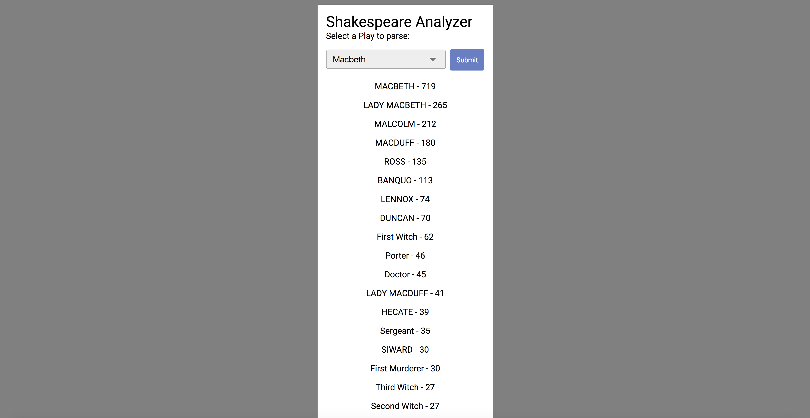

# Shakespeare Analyzer

This project does a simple get request to one of the xml files at http://www.ibiblio.org/xml/examples/shakespeare/

It retrieves a play, parses the XML, and prints out the line count associated with each character

